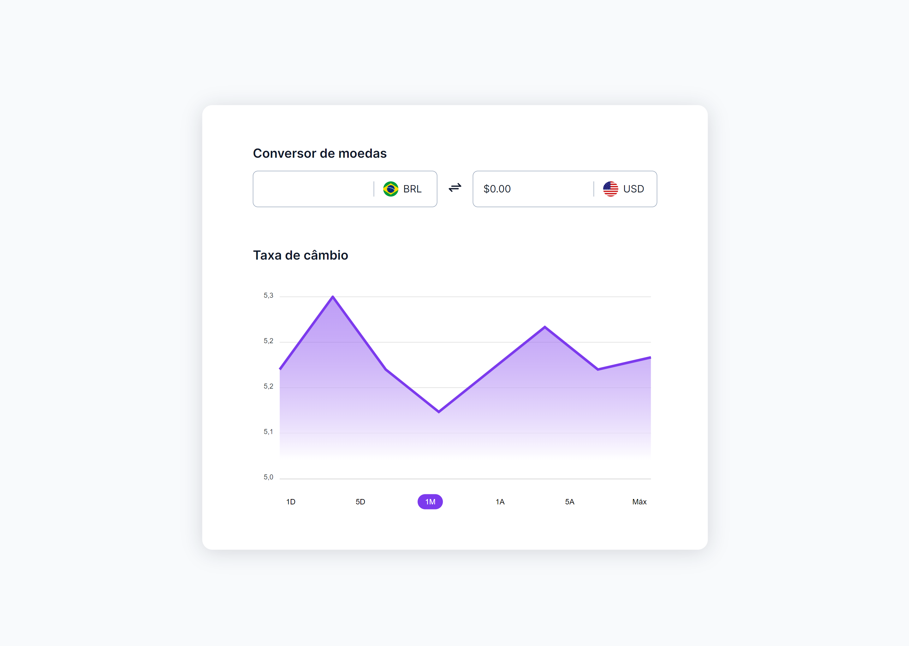

<h1 align="center"> Currency Converter </h1>

[Click here to access](https://remng.github.io/currency-converter/)

## 🚀 Technologies

This project was developed with the follow technologies:

- HTML
- CSS
- JavaScript
- Git and GitHub

## 💻 Project

This currency converter allows the user to calculate the current dollar value against the real using the most recent exchange rate.  

Main feature:

In this project I used JavaScript to take capture the current dollar value through an API.
